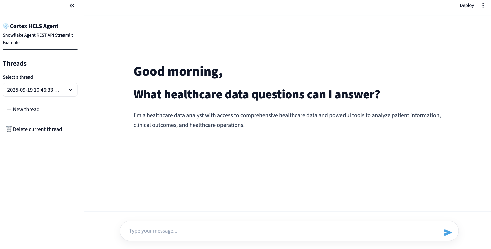

# Snowflake Cortex Agent Streamlit UI

## Screenshot



Run locally:

```bash
cd /Users/mwalli/Documents/Projects/Cursor/CortexAgentStreamlit
python -m pip install -r requirements.txt
streamlit run app.py
```

Configuration:
- In the Streamlit sidebar, enter:
  - Account URL (e.g., https://<account>.snowflakecomputing.com)
  - Auth token (Bearer token)
  - Database, Schema, Agent name
- When running as Streamlit in Snowflake, set these via `st.secrets`:

```toml
# .streamlit/secrets.toml
SNOWFLAKE_ACCOUNT_URL = "https://<account>.snowflakecomputing.com"
SNOWFLAKE_AUTH_TOKEN = "<bearer_token>"
[snowflake]
account_url = "https://<account>.snowflakecomputing.com"
auth_token = "<bearer_token>"
```

Threads:
- Use the sidebar to list, load, or create threads. Conversations will use the selected thread when both `thread_id` and `parent_message_id` are provided.
