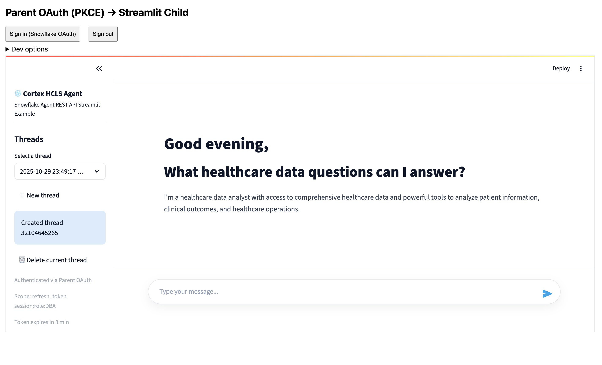

# Snowflake Cortex Agent Streamlit UI

## Screenshot



Run locally:

```bash
cd /Users/mwalli/Documents/Projects/Cursor/CortexAgentStreamlit
python -m pip install -r requirements.txt
streamlit run app.py
```

Configuration (via `st.secrets`):
Option A — Snowflake OAuth (standalone PKCE):

1) Create a Snowflake OAuth security integration (ACCOUNTADMIN):

```sql
use role accountadmin;
create or replace security integration OAUTH_PUB_PKCE
  type = oauth
  enabled = true
  oauth_client = custom
  oauth_client_type = 'PUBLIC'
  oauth_redirect_uri = 'http://localhost:8501/'
  oauth_allow_non_tls_redirect_uri = true
  oauth_enforce_pkce = true
  oauth_issue_refresh_tokens = true
  oauth_refresh_token_validity = 86400;

desc security integration OAUTH_PUB_PKCE; -- copy OAUTH_CLIENT_ID
```

2) Create `.streamlit/secrets.toml`:

```toml
# .streamlit/secrets.toml
SNOWFLAKE_ACCOUNT_URL = "https://<account>.snowflakecomputing.com"
OAUTH_CLIENT_ID = "<OAUTH_CLIENT_ID from DESC>"
OAUTH_REDIRECT_URI = "http://localhost:8501/"
OAUTH_SCOPE = "SESSION:ROLE:<ROLE_NAME>"  # e.g., SESSION:ROLE:PUBLIC
```

3) Start the app and click “Sign in with Snowflake OAuth”. On return, the sidebar shows the OAuth scope and “Token expires in X min”.

Option B — PAT fallback (for quick testing):

```toml
# .streamlit/secrets.toml
SNOWFLAKE_ACCOUNT_URL = "https://<account>.snowflakecomputing.com"
SNOWFLAKE_AUTH_TOKEN = "<bearer_token>"
```

Threads:
- Use the sidebar to list, load, or create threads. Conversations will use the selected thread when both `thread_id` and `parent_message_id` are provided.

Notes:
- PAT is ignored when an OAuth token is present.
- With PUBLIC (PKCE) clients, Snowflake shows a consent page; to avoid re-consent, keep the session and (optionally) implement refresh.
